# Annabel Unofficial Website - Angellington

This project is about a Japanese indie singer called Annabel. Her songs are captivating and very enjoyable, which inspired the creation of this project.
Maybe one day it will become **official**, or maybe not. Regardless, I really enjoyed creating this project.

- [Annabel Unofficial Website - Angellington](#annabel-unofficial-website---angellington)
  - [Overview](#overview)
  - [Usage](#usage)
    - [menu](#menu)
    - [information](#information)
    - [profile](#profile)
    - [discography](#discography)
    - [works](#works)
    - [online shop](#online-shop)
    - [contact](#contact)
  - [Technologies](#technologies)
---

## Overview

  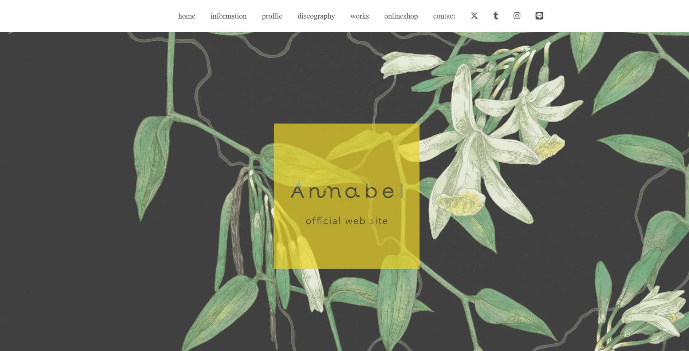
  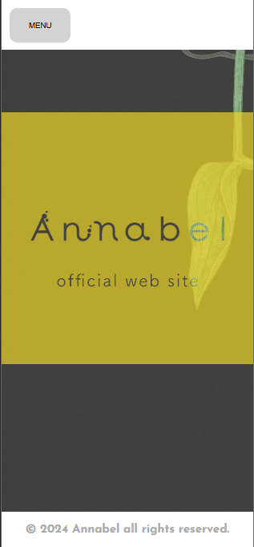

A website for Annabel, her projects, her storyline, and a way to contact her.

- **Purpose**: The website's goal is to let her public know more about her.
- **Target Audience**: Her fans are the main focus.
- **Key Features**: News updates, a contact form to reach her, and a timeline to showcase her journey and projects.
  
## Usage

### menu

There’s a menu that allows navigation to different pages on the website, and each one has its own purpose.

    
    
-

    
<b>home</b> - Main Page

    
<b>information</b> - Last News about Annabel

    
<b>profile</b> - About Annabel

    
<b>discography</b> - Every discography

    
<b>works</b> - Annabel timeline 2005-2024

    
<b>onlineshop</b> - Online shop for buy 

    
<b>contact</b> - Form to contact

---

### information

Bring the latest news about Annabel and her shows.

  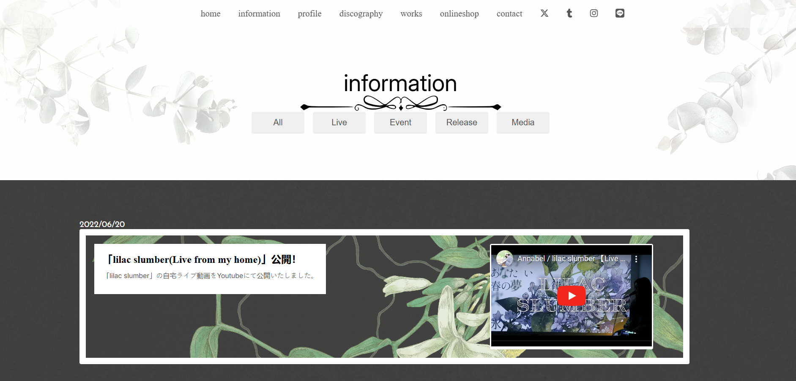
  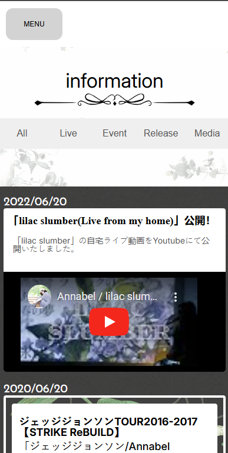

There're some filters like **All** (default), **Live**, **Event**, **Release** and **Media**.

**All** - Every filter in one;

**Live** - Only live events like show;

**Event** - The events have not occurred yet;

**Release** - Last albums are released;

**Media** - Youtube videos.

---

### profile

Singer profile

  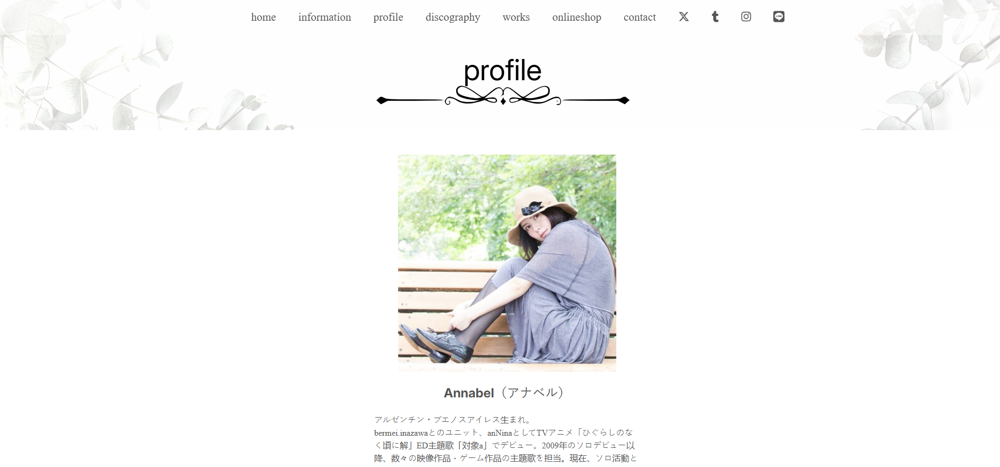
  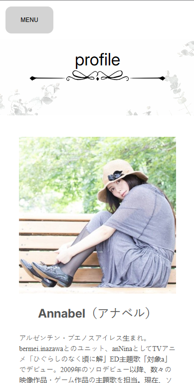

---

### discography

Every discography about Annabel Solo

  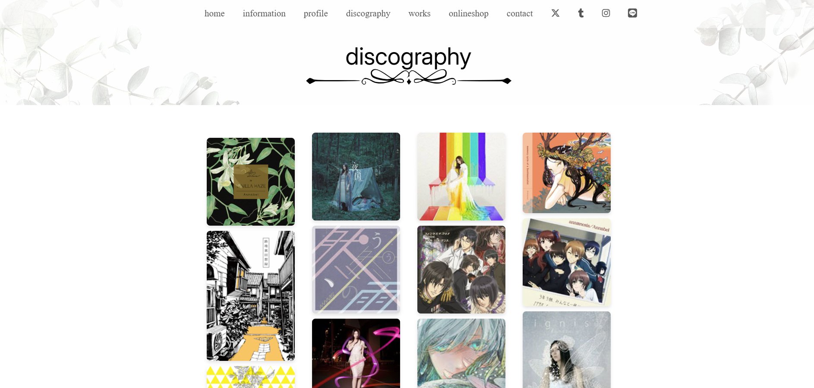
  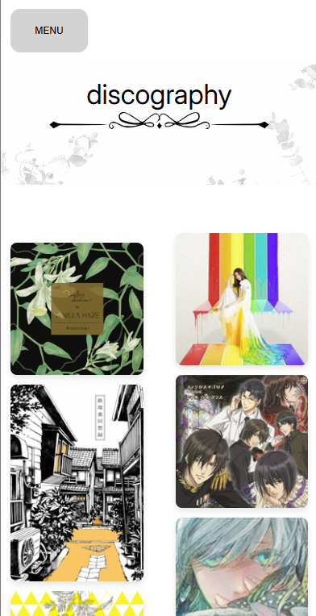

---

### works

Every Annabel solo carrer storyline.

  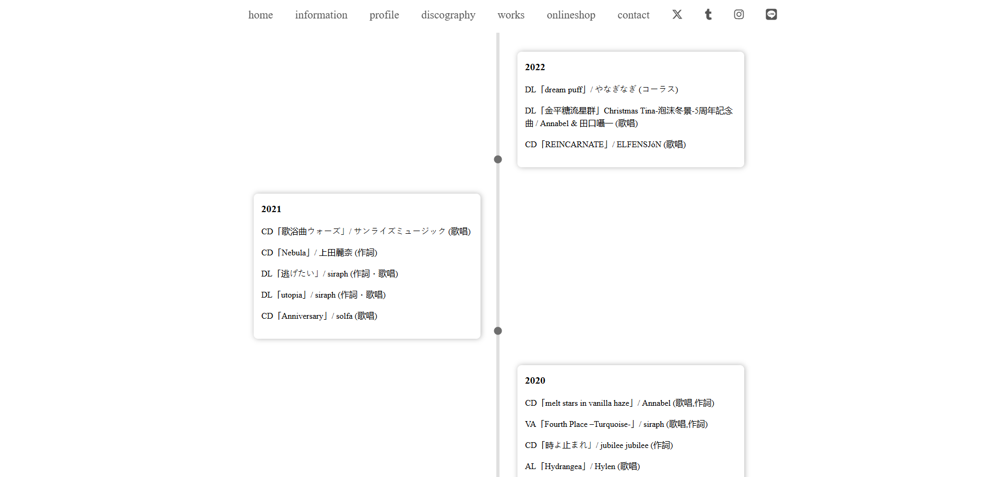
  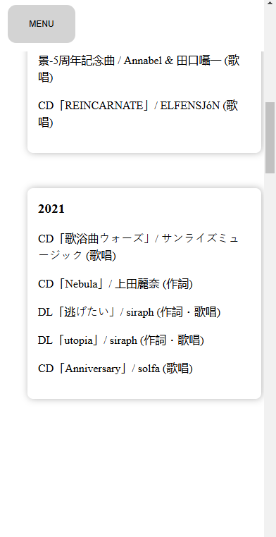

---

### online shop

A link for online shop for buy her albums.

---

### contact

To contact her **(It doesn't work to her)** like a letter. It's send an email to the requester.

  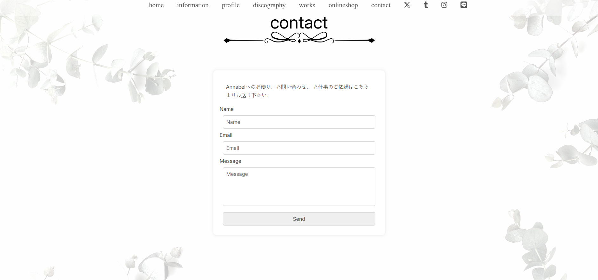
  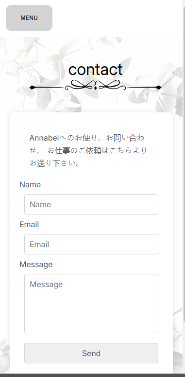

  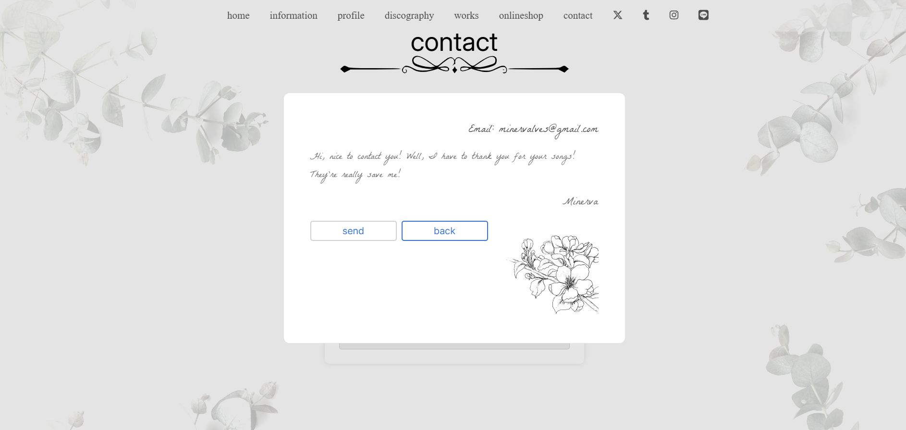
  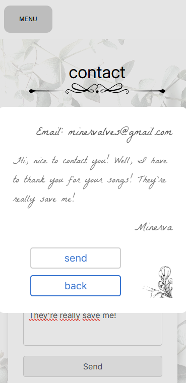

---

## Technologies

- HTML - CSS/SCSS - Javascript
- EmailJS - JSON

---

Really I like so much to work in this project, I learned so much and I liked to build and place my knowledge in this project. Someday I will work more them and improve more. 